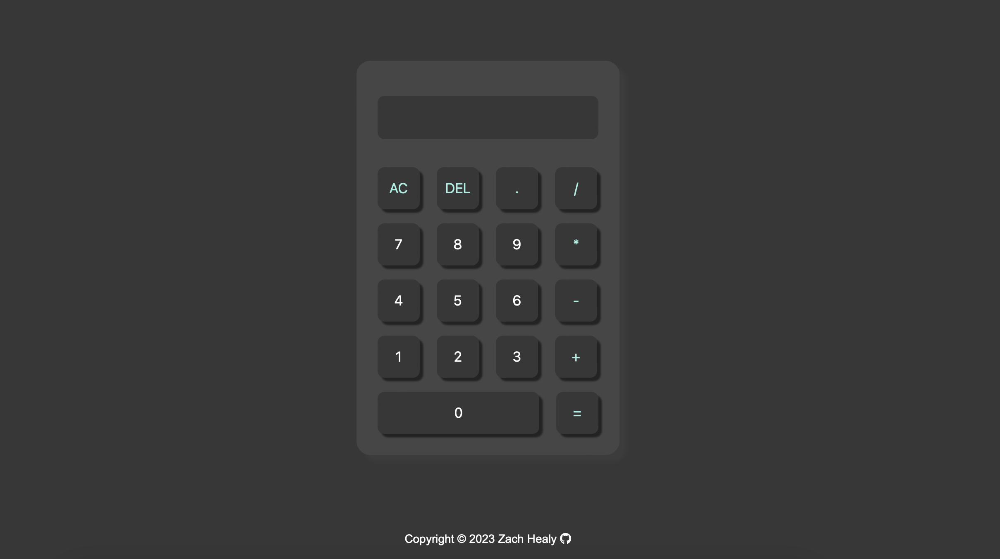

# Calculator
My second time using JavaScript! I created a simple calculator mostly using inline JavaScript

Here is a [link](https://zachhealy.github.io/calculatorApp/) to get to a live version of the project.

Project inspiration from [The Odin Project](https://www.theodinproject.com/lessons/foundations-calculator)

---
### Future Plans
- Maybe implement the JS a little more robustly and in a seperate file
- Use functions for each of the operators instead of using the eval function at the end.

## Screenshots

